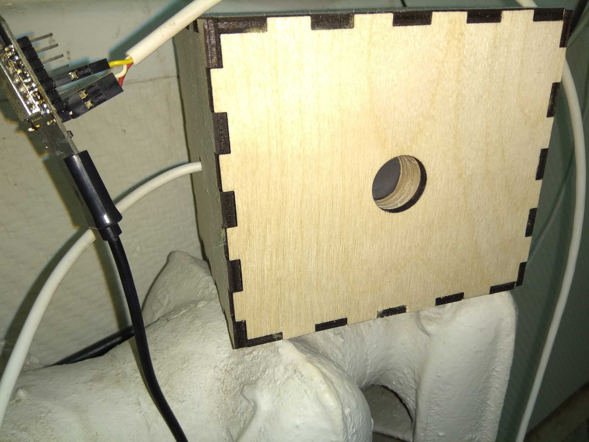
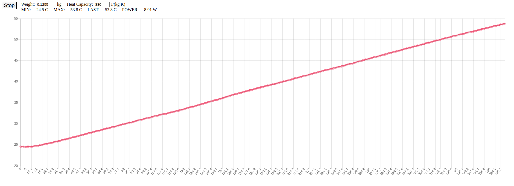

Laser Power Meter
=================

A laser power meter using:

* DS18B20 temperature sensor
* ESP8266
* a 120g aluminium block painted with heat resistant paint and a hole for DS18B20
* some isolating material like glass wool




Setting up
----------

* Note: the provided Makefile requires
  [esptool](https://github.com/espressif/esptool) and
  [notemcu-tool](https://github.com/AndiDittrich/NodeMCU-Tool)
* Connect DS18B20's GND to ESP8266 GND, VIN to 5V, DATA to D3
* Connect ESP8266 using micro-USB to your PC
* Prepare ESP8266 using `make`:

```
# Flash pre-built nodemcu firmware frmo fw/:
make flash

# Edit src/init.lua and specify your wifi ssid & psk
vim src/init.lua

# Upload code from src/:
make upload

# Open serial and watch for ESP8266's IP:
make terminal
```

Type the ESP8266's IP in your internet browser and you should see a website
which charts temperature from DS18B20 over time:



Now fire the laser into the aluminium block and be mindful of reflections.


Calculating the power
---------------------

The website tries to calculate the power automatically, but you can do it
manually using this formula:

```
U = m * c * ΔT

P = U / Δt

P = (m * c * ΔT) / Δt

* U is energy in Joules
* m is mass of the heated body
* c is heat capacity, for aluminium it's about 880 J/(kgK)
* ΔT is temperature difference
* Δt is time elapsed to raise the temperature
* P is power in watts
```

